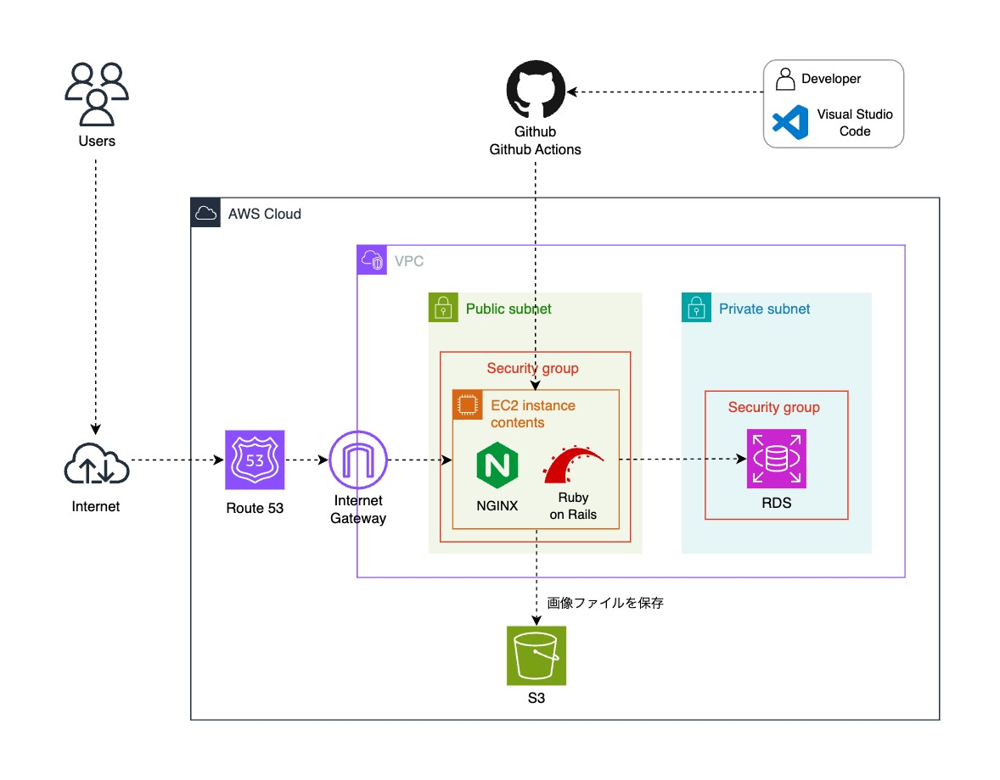
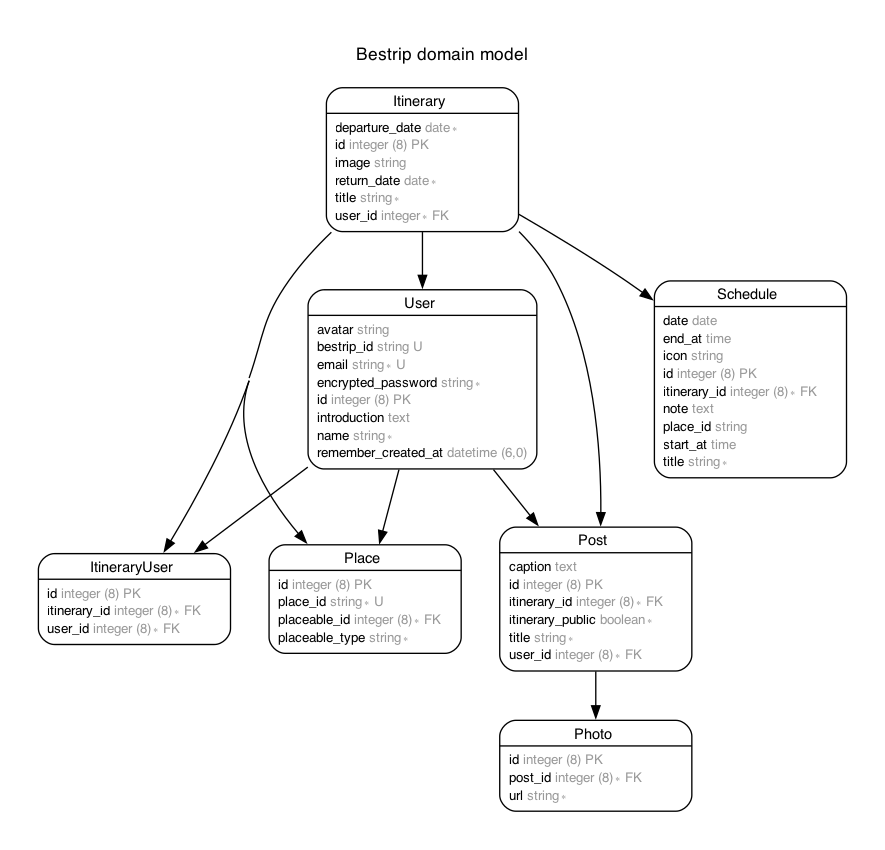

# BesTrip　

BesTripは、Web上で簡単に旅行の計画を立てることができるアプリです。

 

## URL
[https://bestrip.click](https://bestrip.click/)　

トップページの「ゲストログイン」ボタンより、アカウント登録なしでアプリをお試しいただけます。

 

## アプリのイメージ

 

## 使用技術

| カテゴリー | 技術 |
| ---- | ---- |
| フレームワーク | Ruby on Rails 7.0.4 |
| フロントエンド | JavaScript, Turbo, Stimulus |
| バックエンド | Ruby 3.1.3 |
| インフラストラクチャ | Amazon Web Services |
| データベース | PostgreSQL |
| CI/CD | Github Actions |
| デザイン | Canva |
| 外部サービス | Google Maps API |
| その他 | RSpec, RuboCop, Git |

 

## インフラ構成

 

## データベース設計

 

## こだわったポイント

#### - Hotwireの技術を活用し、スムーズな動作を実現
Turbo FramesやTurbo Streamsを使用して、画面の部分更新や、モーダルでのデータ作成・編集、無限読み込み（トップページ）など、SPA風のスムーズな動作を実現し、ユーザーが快適に利用できるようにしました。

#### - Google APIの活用
旅行先の情報を調べやすいように、Googleマップの場所検索機能をアプリ内で利用できるようにしました。 
また、場所の情報として、Google固有の場所IDをデータベースに保存できるようになっており、この場所IDを使って、ユーザーは住所などの情報をいつでもAPIから取得することができます。

#### - ユーザー目線の細かな機能
ユーザーの使いやすさを考え、画像のプレビュー表示や、テキストエリアの文字カウント、ユーザーIDの使用可否チェックボタンなど、細かな機能にもこだわりました。

 

## 機能一覧
| アカウント登録、ログイン機能 |　 プロフィール編集 |
| ---- | ---- |
|  |  |
| Deviseを使用して、アカウント登録及びログイン機能を実装しました。 | プロフィールはパスワード入力無しで編集することができます。項目のひとつである「BesTrip ID」は、本アプリ固有のユーザーIDであり、登録することで他のユーザーから検索してもらえるようになります。|

| 旅のプラン作成 | 旅のメンバー追加、共同編集 |
| ---- | ---- |
|  |  |
| 旅のタイトルと日程を入力し、旅のプランを作成する機能を実装しました。 | ユーザーをIDで検索し、旅のメンバーに追加する機能を実装しました。追加されたメンバーも、スケジュールや行きたい場所リストの編集が可能です。 |

| スケジュール作成 | スケジュール一覧 |
| ---- | ---- |
|  |  |
| スケジュールには日時やメモの他、Google APIを使用してスポットの情報を登録できるようにしました。 | 登録したスケジュールを、日時順で確認することができます。 |

| スポット検索 | 行きたい場所リスト |
| ---- | ---- |
|  |  |
| Google APIを使用し、スポットの名称やキーワードで検索できる機能を実装しました。地図上に表示されたウィンドウからスポット詳細を開き、編集中のプランの「行きたい場所リスト」に追加することができます。 | 「スケジュールに追加」 をクリックすると、スポットの情報が予め入力されたフォームが表示され、そのままスケジュールを追加することができます。|

| 旅の思い出を投稿 | 投稿検索機能 |
| ---- | ---- |
|  |  |
| 旅行後、旅先で撮った写真を投稿できる機能を実装しました。 | 他のユーザーの投稿を、キーワード及びハッシュタグで検索できる機能を実装しました。 |

| 投稿詳細 | お気に入りスポット |
| ---- | ---- |
|  |  |
| フレームワーク | お気に入りに登録したスポットの一覧です。「旅のプランに追加」ボタンから追加したい旅のプランを選択して「行きたい場所リスト」に追加することができます。|

 

## 今後追加したい機能

#### - チャット機能
旅行のメンバー間で利用できるチャット機能を追加し、他のメッセージアプリ等に頼らず、本アプリのみで旅行の計画を進められるようにしたい。

#### - 思い出投稿に対するコメント、「いいね」機能
思い出投稿を充実させ、旅行計画の参考になるプラン情報がたくさん蓄積されているようなアプリにしていきたい。 
そのために、ユーザーの投稿のモチベーションとなるコメントや「いいね」機能を追加したい。
