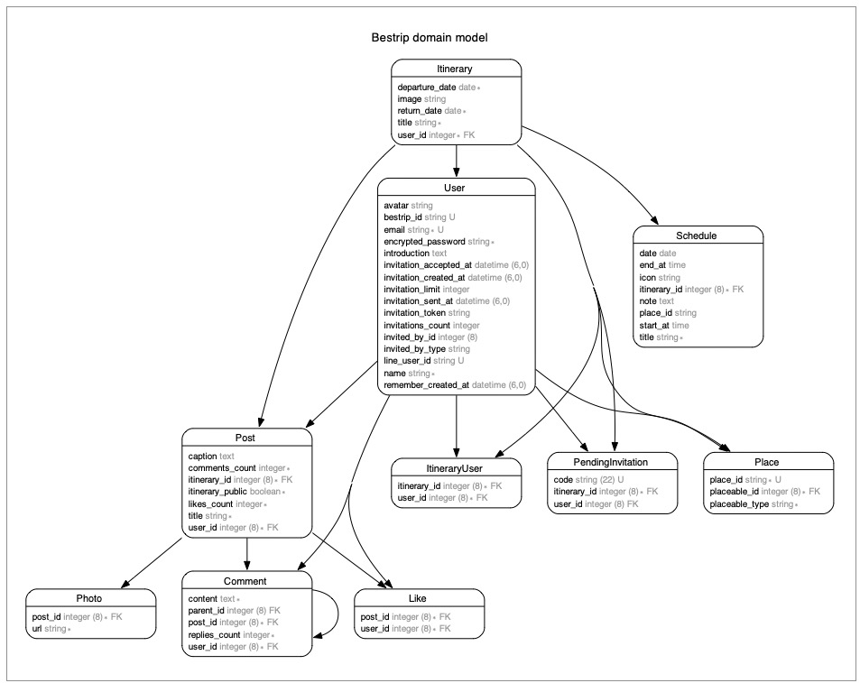

# BesTrip　

BesTripは、Web上で簡単に旅行の計画を立てることができるアプリです。

 

## URL
[https://bestrip.click](https://bestrip.click/)　

トップページの「ゲストログイン」ボタンより、アカウント登録なしでアプリをお試しいただけます。

 

## アプリのイメージ

 

## 使用技術

| カテゴリー | 技術 |
| ---- | ---- |
| フレームワーク | Ruby on Rails 7.0.4 |
| フロントエンド | JavaScript, Turbo, Stimulus |
| バックエンド | Ruby 3.1.3 |
| インフラストラクチャ | Amazon Web Services |
| データベース | PostgreSQL |
| CI/CD | Github Actions |
| デザイン | Canva |
| 外部サービス | Google Maps API |
| その他 | RSpec, RuboCop, Git |

 

## インフラ構成

 

## データベース設計

 

## こだわったポイント

#### - Hotwireの技術を活用し、スムーズな動作を実現
Turbo FramesやTurbo Streamsを使用して、画面の部分更新や、モーダルでのデータ作成・編集、無限読み込み（トップページ）など、SPA風のスムーズな動作を実現し、ユーザーが快適に利用できるようにしました。

#### - Google APIの活用
旅行先の情報を調べやすいように、Googleマップの場所検索機能をアプリ内で利用できるようにしました。 
また、場所の情報として、Google固有の場所IDをデータベースに保存できるようになっており、この場所IDを使って、ユーザーは住所などの情報をいつでもAPIから取得することができます。

#### - ユーザー目線の細かな機能
ユーザーの使いやすさを考え、画像のプレビュー表示や、テキストエリアの文字カウント、ユーザーIDの使用可否チェックボタンなど、細かな機能にもこだわりました。

 

## 機能一覧

| アカウント登録、ログイン |　プロフィール編集 |
| ---- | ---- |
|  |  |
| Deviseを使用してアカウント登録及びログイン機能を実装しました。 | プロフィールはパスワードなしで編集できるようにしました。「BesTrip ID」を登録すると、他のユーザーに検索してもらえるようになります。 |

| 旅のプラン作成 | 旅のメンバー追加、共同編集 |
| ---- | ---- |
|  |  |
| 旅のタイトルと日程を入力し、旅のプランを作成する機能を実装しました。 | ユーザーをBesTrip IDで検索し、旅のメンバーに追加できます。追加されたメンバーも、スケジュールや行きたい場所リストの編集が可能です。 |

| スケジュール作成 | スケジュール一覧表示（日程表） |
| ---- | ---- |
|  |  |
| 日時やメモの他、Google APIから取得したスポット情報を登録することができます。 | 登録済のスケジュールを日時順で表示し、日程表として使用できる画面です。右側のメニューから、スケジュール詳細を確認できます。 |

| スポット検索 | スポット情報表示、行きたい場所リストへの追加 |
| ---- | ---- |
|  |  |
| 場所の名称やキーワードでGoogleマップを検索できる機能を実装しました。地図上のウィンドウをクリックすると、スポットの詳細を確認できます。 | Google APIから取得したスポット情報を表示します。中央のボタンをクリックすると、編集中のプランの「行きたい場所リスト」に追加できます。 |

| 行きたい場所リスト表示、スケジュールへの追加 | 旅の思い出を投稿 |
| ---- | ---- |
|  |  |
| 「スケジュールに追加」 をクリックすると、スポットの情報が入力されたフォームが表示され、スケジュールを作成することができます。 | 旅行後に楽しめる機能として、思い出を投稿する旅のプランを選択し、写真を投稿できる機能を実装しました。|

| 投稿の検索 | 投稿詳細の表示 |
| ---- | ---- |
|  |  |
| キーワード及びハッシュタグで、他のユーザーの投稿を検索できる機能を実装しました。 | 投稿詳細画面では、写真一覧と旅のスケジュールを表示します。右側にアイコンがあるスケジュールは、スポット情報も見ることができます。|

| スポット情報表示、お気に入り登録| お気に入りスポット表示、旅のプランへの追加 |
| ---- | ---- |
|  |  |
| 投稿詳細画面から開いたスポット詳細画面です。中央のボタンをクリックすると、自分の「お気に入りスポット」に追加できます。 | 「旅のプランに追加」ボタンから、スポットを追加したい旅のプランを選択して追加することができます。|

 

## 今後追加したい機能

#### - チャット機能
旅行のメンバー間で利用できるチャット機能を追加し、他のメッセージアプリ等に頼らず、本アプリのみで旅行の計画を進められるようにしたい。

#### - 思い出投稿に対するコメント、「いいね」機能
思い出投稿を充実させ、旅行計画の参考になるプラン情報がたくさん蓄積されているようなアプリにしていきたい。 
そのために、ユーザーの投稿のモチベーションとなるコメントや「いいね」機能を追加したい。
